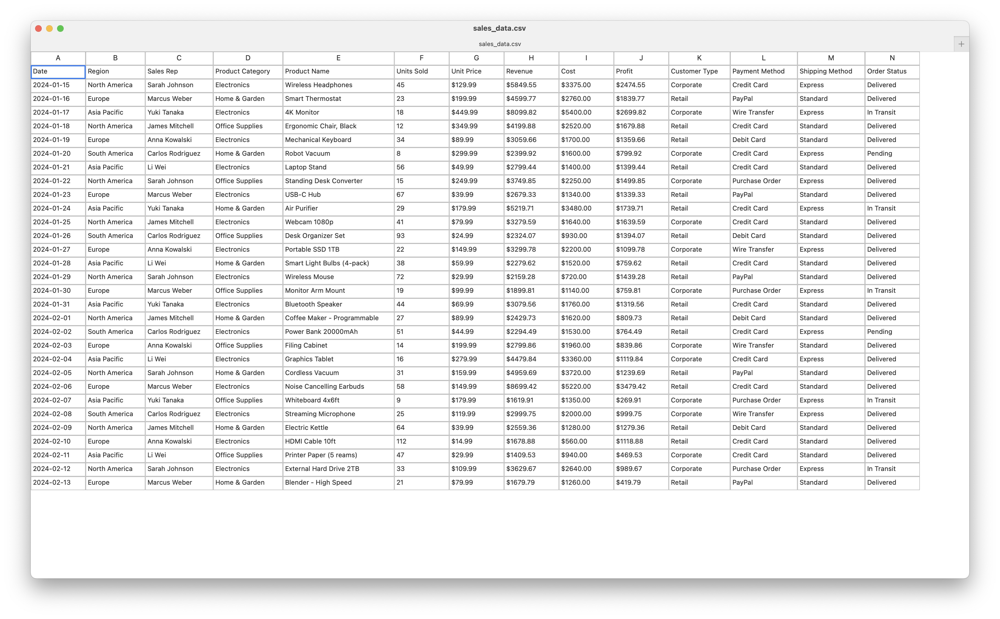

# CSV/TSV Editor for macOS

A simple spreadsheet-like editor for CSV and TSV files built with SwiftUI.



## Features

- Open CSV and TSV files via File menu or command-line argument
- Excel-like grid interface with column headers (A, B, C...)
- Auto-sized columns based on content
- Navigate with arrow keys, Tab, and Shift+Tab
- Edit cells by pressing Enter or just start typing
- Escape to cancel editing
- Copy/paste/cut with standard shortcuts (Cmd+C/V/X)
- Undo edits with Cmd+Z (includes undo for reload)
- Reload file from disk with Cmd+R
- Recent files menu (up to 10 files)
- Automatically detects delimiter (comma or tab)
- Smart modified state tracking (compares with saved state)
- Proper CSV/TSV parsing with quote handling
- Horizontal and vertical scrolling
- Auto-scroll when navigating outside viewport

## How to Build

1. Open `CSVEditor.xcodeproj` in Xcode
2. Select your target Mac as the build destination
3. Press `Cmd+R` to build and run

Or:

```sh
./build-and-run.sh
```

## How to Use

### Opening Files
- Press `Cmd+O` or use File → Open to browse for a file
- Use File → Open Recent to open recently used files
- Pass a file path as a command-line argument: `CSVEditor.app /path/to/file.csv`

### Navigation
- Arrow keys to move between cells
- Tab/Shift+Tab to move right/left
- Click any cell to select it

### Editing
- Press Enter to edit the selected cell
- Or just start typing to replace the cell contents
- Press Escape to cancel and discard changes
- Press Enter or Tab to confirm changes

### File Operations
- `Cmd+S` to save
- `Cmd+Shift+S` to save as
- `Cmd+R` to reload from disk
- `Cmd+Z` to undo changes
- Window title shows `[Modified]` indicator when there are unsaved changes

## Requirements

- macOS 13.0 or later
- Xcode 14.0 or later
